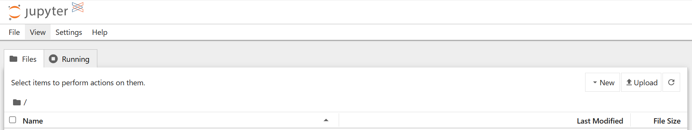
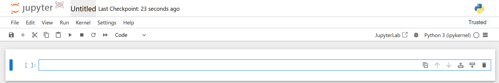
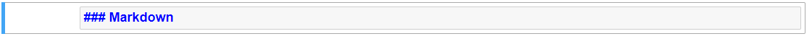
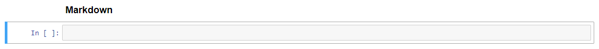

```{r setup, include=FALSE}
# Author: Tina Fu
# Original Date: February 2024
# Version of R: 4.3.2

# See here for learnr package documentation: https://rstudio.github.io/learnr/

# Include packages here that are required throughout the training
Sys.unsetenv("RETICULATE_PYTHON") # This line is needed to run on PWB.
library(learnr)
library(gradethis)
library(reticulate)

knitr::opts_chunk$set(echo = FALSE)

tutorial_options(
  exercise.checker = gradethis::grade_learnr
)

reticulate::virtualenv_create(envname = "pyenv")
reticulate::virtualenv_install("pyenv", packages = c("pandas==2.3.3"))
reticulate::use_virtualenv("pyenv", required = TRUE)
```


```{python pandas-setup, include = FALSE, eval = TRUE}
# Import pandas library
import pandas as pd 

borders = pd.read_csv("data/borders_inc_age.csv")

borders2 = pd.read_csv("data/borders_inc_age.csv", usecols = ['URI', 'HospitalCode', 'Specialty']) 
```

```{r phs-logo, echo=FALSE, fig.align='right', out.width="40%"}
knitr::include_graphics("images/phs-logo.png")
```

## Introduction

Welcome to an introduction to python. This course is designed as a self-led introduction to python for anyone in Public Health Scotland. It covers fundamental knowledge such as various data types (e.g. numbers, strings and boolean), how to write functions, importing and exporting datasets and data wrangling. You can explore python by going through the course and experimenting coding in the embedded code chunks. 

Here is the short video of a quick introduction to python: 

<div class="info_box">
  <h4>Course Info</h4>
  <ul>
    <li>This course is built to flow through sections and build on previous knowledge. If you're comfortable with a particular section, you can skip it.</li>
    <li>Most sections have multiple parts to them. Navigate the course by using the buttons at the bottom of the screen to Continue or go to the Next Topic.</li>
    <li>The course will also show progress through sections, a green tick will appear on sections you've completed, and it will remember your place if you decide to close your browser and come back later.</li>
  </ul>
</div>
</br>

### What is Python?

- Python is a powerful general purpose programming language with widespread use 
in many application domains. 

- Python is open source and free to use, and available for all major operating 
systems.

- Supported on PHS Posit Workbench. 

- Learning Python opens up professional development opportunities. 


## IDE

There are several environments where you can run Python code, such as "VS Code", "JupyterLab", "Jupyter Notebook". Here we will give an introduction on VS Code 
and Jupyter Notebook. 

### VS Code

Visual Studio Code is an open-source code editor that supports multiple programming languages including Python and R and is highly customisable with extensions. For the purposes of this course we will focus on Python. 

#### Getting Started

1. We can access VS Code on [Posit Workbench](https://pwb-prod.publichealthscotland.org/) the same way we access RStudio.
2. After signing in, click on "New Session" and a dialog box will pop up.
3. Click on "VS Code" from the options at the start.
4. Select your memory requirements.
5. Click on "Start Session". 

```{r vscode, fig.align='center', out.width="60%"}
knitr::include_graphics("images/vs-code.png")
```
</br>

##### Layout of the Interface

The layout of the VS Code interface can be divided into 6 different parts:

1. **Activity Bar**: This is located on the far left side of the interface. This lets you access different options and switch between different views on the primary side bar.

2. **Primary Side Bar**: This is located on the left side of the interface to the right of the activity bar. It contains different views like the Explorer, Search, and Source Control to assist you while working on your project.

3. **Editor**: This is located in the center of the interface and is the main place to edit your files. You can open as many editors as you like side by side vertically and horizontally.

4. **Panel**: This is located at the bottom of the interface below the editor. This contains output, debug information, errors and warnings, and an integrated terminal. To open the terminal the keyboard shortcut is *Ctrl + '*.

5. **Command Palette**: This is located right at the top of the interface. The keyboard shortcut *Ctrl + Shift + P* brings up the Command Palette and provides access to commands.

6. **Status Bar**: This is located right at the bottom of the interface and provides information about the open project.

```{r vscodeoverview, fig.align='center', out.width="100%"}
knitr::include_graphics("images/vs-code-overview.png")
```

##### Opening Files and Folders

Once your session opens you can go ahead and open a folder by either clicking on the folder in the explorer pane and then "Open Folder". You can open a file using the keyboard shortcut (*Ctrl + O*). You can create a new file by pressing the "New File" button located to the right of your folder name.

```{r vscodefile, fig.align='center', out.width="40%"}
knitr::include_graphics("images/vs-code-file.png")
```

The file path for your home directory (`~` in R Studio) is `/mnt/homes/your_username/`. The stats drive can be accessed the same as R Studio: `/conf/...`.
</br>

#### Setting Up

Before you start using VS Code you must set up a few different aspects. This section will cover extensions and environments. Although this section should be sufficient for getting set up, for full detailed instructions please see: [VS Code Setup instructions](https://github.com/Public-Health-Scotland/vscode_prep). These instructions include setting up extensions, creating environments, installing packages, using version control, and other hints and tips.

##### Extensions

In order to use VS Code you first need to install extensions. Extensions are essentially add-ons that allow you to customise what VS Code can do.  You can install extensions individually however for getting started it is recommended that you do the following: 

1. Clone the following repo that can be found [here](https://github.com/Public-Health-Scotland/vscode_prep). This can be done by entering the following into the terminal `git clone https://github.com/Public-Health-Scotland/vscode_prep.git`.

2. Once cloned, open this folder. To do this, click the explorer button on the left hand menu and then click on the open folder button. You should then be able to select the "vscode_prep" folder and click "OK".

3. Within this folder is a script called `install_extensions.sh` which will automate the installation process. It already contains the extensions you will need to get started but it can be modified depending on your needs. To execute this script enter `bash install_extensions.sh vscode base` in the terminal.

4. You will see *Installation completed!* in your terminal. This means everything has worked and the extensions should have been installed. Go to Extensions icon on Activity Bar and you should see a list of the extensions installed.


##### Environments

You can use venv (similar to renv in R) to create environments (private package container). It is recommended that for each project you have a new environment. You can create venv inside your Python project or outside. 

To create your first venv follow these instructions:

1. If you cloned vscode_prep, you should close vscode_prep ("File" then "Close Folder") first and start from the main user path. Open the terminal and create a folder for your new project (e.g python_demo). Use the following command in your terminal `mkdir python_demo`.

2. Open this folder by clicking the explorer button on the left hand menu and then clicking on the open folder button. You should then be able to select the python_demo folder and click ok.

3. In order to create a venv within this folder enter `python -m venv .venv` into the terminal. This creates a venv using whichever interpreter Python currently points to on your system. If you wish to specify a folder outwith your current folder and want your environment to use a specific Python version use something like: `/opt/python/3.11.13/bin/python3 -m venv your_file_path/.venv`. This uses the Python 3.11.13 interpreter to create a virtual environment at `your_file_path/.venv`.

4. Once you have created your environment you will need to activate it. If your venv is in your current folder enter the following into the terminal `source .venv/bin/activate`. If your venv is outwith your current folder you will need to specify the file path like the following `source your_file_path/.venv/bin/activate`.

5. You can refresh your VS Code to make sure your venv has been detected. Press *Ctrl + Shift + P* and search Developer reload window. You should see .venv as part of the terminal line. If venv has not been detect you may need to press *Ctrl + Shift + P*, search "Python: Select Interpreter" and manually select your venv.
```{r vscodevenv, fig.align='center', out.width="100%"}
knitr::include_graphics("images/vs-code-venv.png")
```

6. You will need to update your pip (Python package manager) which helps to download new packages: `pip install --upgrade pip wheel`.

7. You have 2 options to install required packages (once your Python environment is activated). 
* Option 1: Best practice is to have a `requirements.txt` file in every Python project folder. This would contain all the required packages for your project. An example of a `requirements.txt` file can be found in the [VS Code Setup instruction](https://github.com/Public-Health-Scotland/vscode_prep). To execute your file enter the following into the terminal `pip install -r requirements.txt --prefer-binary`.
* Option 2: Installing one package at a time using the command in terminal: `pip install pandas==2.3.3 --prefer-binary`.

Note: If you don't activate your Python environment you will probably install your package in the main Python installation.


#### Running Code

VS Code provides multiple ways to run code, with different approaches being more suitable depending on your workflow and the type of task you are performing.

##### Running an Entire Script

To execute the full script you can type the following into the terminal and press enter. The easiest way to open the terminal is the keyboard shortcut (*Ctrl + '*).
```{python terminal, eval = FALSE, echo = TRUE}
python your_file_name.py
```

Another way to run the whole script is to use the run Python file button at the top of the editor. This is similar to using source to run a script in RStudio.

##### Running Code Snippets Interactively

If you wish to run snippets of your code or run it line by line you can do this using a Python Interactive Window. By pressing *Shift + Enter* on a line of code it should open an interactive window as shown below. You can also highlight sections of code and press *Shift + Enter*. This is very similar to running code in RStudio by pressing *Ctrl + Enter*.

When you run code interactively you have to make sure the kernel selected in the right hand corner of the interactive pane is the correct venv.

```{r vscodeinteractive, fig.align='center',out.width="100%"}
knitr::include_graphics("images/vs-code-interactive.png")
```

##### Jupyter Notebook in VS Code

You can also use Jupyter Notebook by creating a .ipynb file. Each cell can be executed individually using *Shift + Enter* or by pressing the run button. This allows you to create code or markdown snippets. A more detailed introduction of Jupyter Notebook is in the next section.

When using Jupyter notebooks you have to select a kernel in the top right hand corner of your notebook. You should select the venv you have created for your project.

```{r vscodenotebook, fig.align='center',out.width="100%"}
knitr::include_graphics("images/vs-code-notebook.png")
```


### Jupyter Notebook

Jupyter Notebook is designed for the easy integration of text and Python programming. It provides a more interactive workflow for Python programming, analysis and reporting. Some of its key features are:

- Code completion
- Syntax highlighting
- Code refactoring (find and replace)
- Integrated documentation viewer
- Ability to combine text, equations and images as well as code in a single document
- All outputs of the executed code are saved and embedded in the notebook
- Cell based execution and editing of code/text segments

#### Open a New Jupyter Notebook

We can access "Jupyter Notebook" on [Posit Workbench](https://pwb-prod.publichealthscotland.org/). After signing in, click on New Session and a diaglog box will pop up. Click on "Jupyter Notebook" and then click "Launch". 

```{r openpynb, fig.align='center', out.width="60%"}
knitr::include_graphics("images/python-pwb.png")
```

</br>

You will see the interface looks like this. There are three main tabs in Jupyter on start-up:

- **Files** Your file directory
- **Running** Lists all of the notebooks currently running

```{r startsession, fig.align='center', out.width="100%"}

```

</br>

To open a new Jupyter Notebook, click the "New" drop down menu on the Files tab and select “Python 3 (ipykernel)” under the notebooks heading. This will open a blank Notebook with an IPython console running underneath it. 

```{r newnb, fig.align='left', out.width="25%"}
knitr::include_graphics("images/python-pwb-newnb.png")
```

</br>

```{r blanknb, fig.align='center', out.width="100%"}

```

</br>

The IPython console is used to input and execute Python code interactively. Outputs, errors and warning messages are directly shown in the same window. A command that has been entered into the console is executed by

- Pressing *Shift + Enter* to execute all the codes in the current active cell and advance the cursor to the next cell. Or press the “run cell, select below” button   on the toolbar. 

- Pressing *Ctrl + Enter* to execute all the codes in the current active cell. If you want to move to the next cell below, just simply click on the “insert cell below” button  on the toolbar.

#### Command and Edit Modes

Jupyter notebook is a modal editor which means that the keyboard does different things depending on which mode the Notebook is in. There are two modes: **edit mode** and **command mode**. 

- **Edit mode** - it is indicated by a green cell border and left sidebar, and a prompt showing in the editor area: 

```{r editmode, fig.align='center', out.width="100%"}

```

When a cell is in edit mode, you can type things such as Python codes into the cell, like a normal text editor. Enter edit mode by pressing Enter or using the mouse to click on a cell’s editor area. 

- **Command mode** - Once you click somewhere else outside the cell or press “esc” on keyboard, the cell turns into Command mode. Command mode is indicated by a grey cell border and a blue sidebar:

```{r commandmode, fig.align='center', out.width="100%"}

```

When you are in command mode, you are able to edit the notebook as a whole, but not type into individual cells. Most importantly, in command mode, the keyboard is mapped to a set of shortcuts that let you perform notebook and cell actions efficiently. For example, if you are in command mode and you press C and V, you will copy and paste the current cell.

A full list of useful shortcuts is available by going to "Help > Keyboard Shortcuts" (You can also access by pressing H in command mode).

#### Markdown Text Cells

Markdown text cells support plain text, Markdown and HTML. It will be useful to create headings, text instructions etc using markdown to organise the notebook like a written document. A cell can be changed from code mode to markdown mode by going to the top menu bar "Cell > Cell Type > Markdown". Or select “Markdown” from the dropdown list:

```{r markdown, fig.align='center', out.width="100%"}

```

Or press M while in Command Mode and highlighting the cell. 

Here is an example of typing some text in a markdown cell. You can use hash key “#” to indicate the size of heading, followed by a space and the text. 

```{r markdown-example1, fig.align='center', out.width="100%"}

```

Then press *Shift + Enter* to finish. 

```{r markdown-example2, fig.align='center', out.width="100%"}

```


## Foundations

This section will walk you through some of the foundational knowledge of Python, including structure, style, and key data types.

We’re going to start with a high-level overview of programming concepts which will help lay the foundations for building your python skills. We’ll then build on these concepts with the specific syntax in python. This graphic shows the structure of the concepts and how they come together to form a program:

<div class="supporting-image-left">
```{r foundations-buildingblocks, echo=FALSE, fig.align='center', out.width="75%"}
knitr::include_graphics("images/foundations-buildingblocks.png")
```
</div>

1. **Basic data types** - representing fundamental data, like numbers and text.

2. **Complex data types** - taking basic data types and forming more complex, composite data types, e.g. tables.

3. **Variables** - named storage to track "objects" across a program.

4. **Statements** - a complete line of code, made of expressions and operators.

5. **Control Flow** - branching (if statements) and iteration (loops).

6. **Functions** - reusable chunks of code that can take inputs and give outputs.

</br>

### How does Python run?

Traditionally, when a Python script is run, the entire script is interpreted and run from the top down. 

```{python runtime, eval = FALSE, echo = TRUE}
a = 15
b = 10
c = a + b 
print(c)
```

When the above Python script is run, the entire script will be run from the top down, resulting in an output of `25`.

There are a number of advantages to having Python scripts run this way. To name a few:

* The script has a sequential flow
* It is easier to debug
* It is clearer and more readable

There are also a number of ways to run individual lines of code within a Python script as described in the IDE section.

### Structure

**Indentation** - where indentation in other programming languages are included as a style preference, indentation in Python is extremely important, as it indicates what blocks of code should be run. 

Without proper indentations, your code will not run. Try to run the following code with improper indentation and see what the syntax error will be shown:

```{python indentation1, exercise = TRUE}
if 1 < 10:
print("One is less than ten.")
```

Now run the code with the proper indentation:

```{python indentation2, exercise = TRUE}
if 1 < 10:
  print("One is less than ten.")
```

Indentation not only affords proper functionality, but it also enhances readability and comprehension for yourself, and future co-developers. 

### Python Variables

Variables are containers for storing data values. A variable is created the moment you first assign a value to it using `=`.

```{python assignvariable, exercise=TRUE}
x = 5
y = "John"
print(x)
print(y)
```

A variable can have a short name (like x and y) or a more descriptive name (age, carname, total_volume).

Rules for Python variables:

- A variable name must start with a letter or the underscore character
- A variable name cannot start with a number
- A variable name can only contain alpha-numeric characters and underscores (A-z, 0-9, and _ )
- Variable names are case-sensitive (age, Age and AGE are three different variables)
- A variable name cannot be any of the Python keywords.

### Basic Data Types

#### Numbers

There are 3 main types of numbers that can be declared in Python.

1. **Integer** - Whole numbers, positive or negative, without a fractional part. They have unlimited precision in Python 3.

2. **Floating point** - Real numbers with a fractional part, denoted by a decimal point or scientific notation.

3. **Complex** - Numbers with a real and an imaginary component, written as `a + bj`, where `a` is the real part and `b` is the imaginary part.

```{python numbers, eval = FALSE, echo = TRUE}
age = 27 # Integers
height = 1.76 # Floating point numbers
k = 6.626e-32 # Using scientific notation
var1 = 2 + 5.2j # Complex numbers
```

#### Arithmetic Operators

The following are examples of all the arithmetic operators available in Python. 

```{r, echo = FALSE}
operators_table <- data.frame(
  "Operator" = c("`**`", 
                 "`%`", 
                 "`*` `/`", 
                 "`//`", 
                 "`+` `-`", 
                 "`>` `<` `==` `!= or ~=` `<=` `>=`", 
                 "`! or ~`", 
                 "`&`", 
                 "<code>&#124;</code>"), 
  "Description" = c("Power", 
                    "Modulus (remainder after division)", 
                    "Multiplication, Division", 
                    "Floor Division (round down after division)", 
                    "Addition, Subtraction", 
                    "Comparison Operators (Greater than, Less than, Equal to, Not Equal to, Less than or equal to, Greater than or equal to)", 
                    "Logical NOT", 
                    "Logical AND", 
                    "Logical OR")
)

knitr::kable(operators_table)
```

#### Strings

Strings in Python are arrays of unicode characters. However, Python does not have a character data type, a single character is simply a string with a length of 1. Strings can be declared with either single or double quotes, and square brackets `[]` can be used to access elements of the string.

```{python strings1, exercise = TRUE}
a = "Hello, World!"

# Get the character at position 1 (the first character has the position 0)
print(a[1])
```

Multiline strings can be declared with triple single and triple double quotes, but note that whitespace characters are recorded in the string e.g. for tabs and for newlines. 

```{python strings2, exercise = TRUE}
multiline = '''White space is
preserved
in multiline strings.'''

multiline
```

The `print()` function interprets these escape characters as expected. 

```{python strings3, exercise = TRUE}
multiline = '''White space is
preserved
in multiline strings.'''

print(multiline)
```

Different string quoting styles can be nested as only the outer one is used. You can also use a backslash to escape quote characters within the string if you need to display them. 

```{python string4, exercise = TRUE}
nested_quotes = 'It\'s sometimes "necessary" to escape things'
nested_quotes
print(nested_quotes)
```

For strings, the plus `+` sign will concatenate two strings into one, and the asterisk `*` will repeat a string a set number of times. 

```{python string5, exercise = TRUE}
print('Hello' + ' ' + 'World')
print('Hello' + ' ' + 'World' * 4)
print('Hello' + (' ' + 'World') * 4)
```

</br>

Python has a set of built-in methods that you can use on strings, such as:

```{r echo = FALSE}
string_method <- data.frame("Method" = c("capitalize()", "casefold()", "count()"), 
                            "Description" = c("Converts the first character to upper case", 
                                              "Converts string into lower case", 
                                              "Returns the number of times a specified value occurs in a string"))

knitr::kable(string_method)
```

```{python string6, exercise = TRUE}
txt = "i love apples, apple ARE my favorite fruit"

txt.capitalize()
txt.casefold()
txt.count("apple")
```

#### Boolean

Booleans represent either `True` or `False`.

When Python code is run, expressions can be compared and a Boolean answer can be returned:

```{python boolean1, exercise = TRUE}
print(5 == 5)
print(10 == 2)
print(5 < 4)
```

If a value has some sort of content, it is normally evaluated as true:

```{python boolean2, exercise = TRUE}
bool("Hi")
bool([])
bool(0)
bool("")
bool(None)
```

Note that the empty `list`, `0`, `""`, and `None` all returned `False` as they don't have any content.

#### Data Types and Type Conversion

Dynamic typing is one of Python's core features that sets it apart from statically typed languages. In Python, variables are not bound to a specific type at declaration. Instead, the type is determined at runtime based on the assigned value. This means that a single variable can hold data of different types throughout its lifetime hence making Python a flexible and easy-to-use language for rapid development and prototyping. The `type()` function can be used to query the type of a Python object, and any type conversion can be performed by using the appropriate function e.g. `int()` for integer, `str()` for string, and `float()` for a floating point number. 

```{python type-conversion, exercise = TRUE}
myint = 12345
type(myint) # Check the data type of myint

mystr = str(myint) # Convert myint to a string
myfloat = float(myint) # Convert myint to a floating point number

mystr
myfloat
```


## Data Structures

There are various data structures which are built into Python. Some of the main ones are:

- **Sequence Types:** list, tuple, range
- **Mapping Type:** dict
- **Set Types:** set, frozenset

#### Lists

- Lists are ordered collections of items.
- They are mutable, meaning you can add, remove, or modify elements.
- Lists can contain elements of different data types.

```{python list, exercise = TRUE}
my_list = [1, 2, 'apple', 'banana']
print(my_list)
```

#### Tuples

- Tuples are ordered collections of items, similar to lists.
- Tuples are immutable - once they are created, the elements cannot be changed.
- Tuples can contains elements of different data types.

```{python tuples, exercise = TRUE}
my_tuple = (1, 2, 'apple', 'banana')
print(my_tuple)
```

#### Dictionaries

- Dictionaries are unordered collections of key-value pairs.
- They are mutable, and each key within a dictionary must be unique.
- Dictionaries are used when you need to associate some data (value) with a specific identifier (key).


```{python dictionaries, exercise = TRUE}
my_dict = {'name': 'John', 'age': 30, 'city': 'New York'}
print(my_dict)
```

You can then retrieve associate values as such:

```{python dictionaries2, exercise = TRUE}
my_dict = {'name': 'John', 'age': 30, 'city': 'New York'}

name_value = my_dict['name']
print(name_value)
```

#### Set

- Sets are unordered collections of unique items.
- They are mutable, but their elements must be immutable.
- Sets are useful for operations like finding intersections, unions, and differences between collections.

```{python sets, exercise = TRUE}
my_set = {1, 2, 3, 4, 5}
print(my_set)
```


## Control Flow & Iteration

As is the case in most other programming languages, control flow is where decisions are made, and iteration is where processes are repeated. 

### Control Flow - If

`if` is the most common comparison operator used in Python.

```{python if1, exercise=TRUE}
a = 5
b = 100

if a == 5:
  print("a is equal to 5")

if b > a:
  print("b is greater than a")
```

There are some further statements when using `if` that you should be familiar with:

- `elif` is short for *else if*. `elif` keyword is Python's way of saying "if the previous conditions were not true, then try this condition". It allows you to check multiple expressions for `True` and execute a block of code as soon as one of the conditions evaluates to `True`.

- `else` keyword catches anything which isn't caught by the preceding conditions. It is executed if the preceding `if` and `elif` statements are evaluated to `False`.

```{python if2, exercise=TRUE}
a = 100
b = 35

if b > a:
  print("b is greater than a")
elif a == b:
  print("a and b are equal")
else:
  print("a is greater than b")
```

If you have only one statement to execute, you can put it on the same line as the `if` statement.

```{python if3, exercise=TRUE}
a = 8
b = 3
if a > b: print("a is greater than b")
```

### While Loop
With the `while` loop we can execute a set of statements as long as a condition is true.

```{python whileloop1, exercise=TRUE}
i = 1 # define an indexing variable and set to initial value as 1
while i < 6:
  print(i)
  i += 1
```

#### The break() Statement

With the `break` statement we can stop the loop even if the while condition is true:

```{python whileloop2, exercise=TRUE}
i = 1
while i < 6:
  print(i)
  if i == 3:
    break
  i += 1
```

#### The continue() Statement

With the `continue` statement we can stop the current iteration, and continue with the next:

```{python whileloop3, exercise=TRUE}
i = 0
while i < 6:
  i += 1
  if i == 3:
    continue
  print(i)
```

#### The else() Statement

With the `else` statement we can run a block of code once when the condition no longer is true:

```{python whileloop4, exercise=TRUE}
i = 1
while i < 6:
  print(i)
  i += 1
else:
  print("i is no longer less than 6")
```

### For Loop

For loops are used for iteration over a sequence (that is either a list, a tuple, a dictionary, a set, or a string). 

There are multiple ways to use `for` loops.

#### Iterating Over a List:

```{python forloop1, exercise=TRUE}
list_of_fruits = ["apple", "banana", "cherry"]

for fruits in list_of_fruits:
  print(fruits)
```

#### Using Enumerate:

You can also use `enumerate` to iterate over a sequence and get the index position of each item:

```{python forloop2, exercise=TRUE}
list_of_fruits = ["apple", "banana", "cherry"]

for index, fruits in enumerate(list_of_fruits):
  print(index, fruits)
```

#### Iterating Over a String:

Iterating over a string with `print()` can print each character in the string in order:

```{python forloop3, exercise=TRUE}
for char in "Python":
    print(char)
```

#### Iterating Over a Range:

To loop through a set of code a specified number of times, we can use the `range()` function,

The `range()` function returns a sequence of numbers, starting from index 0 by default, and increments by 1 (by default), and ends at a specified number.

Note that `range(6)` is not the values of 0 to 6, but the values 0 to 5.

```{python forloop4, exercise=TRUE}
for i in range(6):
    print(i)
```

The `range()` function defaults to 0 as a starting value, however it is possible to specify the starting value by adding a parameter: `range(2, 6)`, which means values from 2 to 6 (but not including 6):

```{python forloop5, exercise=TRUE}
for i in range(2, 6):
    print(i)
```

The `range()` function defaults to increment the sequence by 1, however it is possible to specify the increment value by adding a third parameter: `range(2, 30, 3)`:

```{python forloop6, exercise=TRUE}
for i in range(2, 30, 3):
    print(i)
```

#### The break() Statement

With the `break` statement we can stop the loop before it has looped through all the items:

Exit the loop when x is "banana":

```{python break1, exercise=TRUE}
fruits = ["apple", "banana", "cherry"]
for x in fruits:
  print(x)
  if x == "banana":
    break
```

Exit the loop when x is "banana", but this time the break comes before the print:

```{python break2, exercise=TRUE}
fruits = ["apple", "banana", "cherry"]
for x in fruits:
  if x == "banana":
    break
  print(x)
```

It would not print "banana" as the loop has already been exit when x equals to "banana".

#### The continue() Statement

With the `continue` statement we can stop the current iteration of the loop, and continue with the next:

```{python continue, exercise=TRUE}
fruits = ["apple", "banana", "cherry"]
for x in fruits:
  if x == "banana":
    continue
  print(x)
```

It would not print "banana" as the loop was stopped when x equals to "banana", and then continue with the next one "cherry". 

#### Nested Loops

```{python forloop7, exercise=TRUE}
adjective = ["small", "big", "tasty"]
fruits = ["apple", "banana", "cherry"]

for x in adjective:
    for y in fruits:
        print(x, y)
```


## Functions & Libraries

In Python, functions are a block of organised and reusable code which performs a specific task.

Functions can be called from anywhere within the script, and can be stored anywhere within the script - **however**, it is custom convention to store functions at the top, or near the top, of the script in order to enhance readability and maintenance of the code. 

### Structure

Functions are made up of the:

* Defined keyword `def`
* Function name
* `()` parentheses which may include parameters.
* Function body

```{python function1, eval = FALSE, echo = TRUE}
def function_name():
  function_body
```

Example:

```{python function2, exercise=TRUE}
def greet():
  print("Hello!")
```

When you run the above code, you will see that nothing is output - this is because the function has not been called.

```{python function3, exercise=TRUE}
def greet():
  print("Hello!")

greet()
```

### Parameters and Arguments

Parameters are variables which are listed inside the parentheses in the function definition. They are placeholders for actual values which will be passed into the function when it is called.

The values passed into a function are called arguments. 

```{python function4, exercise=TRUE}
def greet(name): # set the parameter as name
  print("Hello, " + name + "!")
  
greet("Bob") # argument as Bob
```

You can also pass through multiple arguments:

```{python function5, exercise=TRUE}
def add(a, b, c):
  print(a + b + c)
  
result = add(1, 2, 3)
```

### Return

The return statement can optionally be used to return the data back to the caller.

```{python function6, exercise=TRUE}
def add(a, b, c):
  return a + b + c
  
result = add(1, 2, 3)
print(result)
```

### Python Library

Python library is a collection of functions and methods that allows you to perform lots of actions without writing your own code. For example, “pandas” is a Python library for data manipulation and analysis, which is used a lot in this training guidance. 


## File Handling

The Python language can be used for data analysis. The first step in performing analysis is to access your dataframe (i.e. your dataset). This section will introduce you how to import and export datasets. 

### Read and Save .csv/.xlsx Files

Various commonly used file formats can be read using Python, such as .csv and .xlsx files. You can import these files by using the “pandas” library. The general code is 

```{python file-read, eval = FALSE, echo = TRUE}
dataset_name = pd.read_csv("filepath/filename.csv")
dataset_name = pd.read_excel("filepath/filename.xlsx")
```

There are three pieces to this code:

- to the right of the `=` sign is the pandas import code:
`pd.read_csv("filename.csv")`
- to the left of the `=` sign is the name we've given to the dataset:
`dataset_name`
- the `=` sign tells Python to connect the name `dataset_name` to the imported dataset

This is an example of a more general concept in Python called **variable assignment**. A **variable** in Python is a name for referring to an object, just like `dataset_name` refers to the imported dataset. The object in question is called the **value** of the variable. 

To assign a value to a variable, we use the `=` sign as above:

```{python variable-assignment, eval = FALSE, echo = TRUE}
variable = value
```

**Also remember that Python is a case-sensitive language.**

Here is a real example for importing a dataset "borders_inc_age.csv". 
Have a look and click 'Run Code' below to see the output. 

```{python csv-read-example, exercise = TRUE}
# Import pandas library
import pandas as pd

# Read in the dataset
borders = pd.read_csv("data/borders_inc_age.csv")

# Check the first few rows of the dataset. Default is 5 rows. 
borders.head() 
```

If you make any changes to borders and would like to save it as a new .csv file, use the following command:

```{python file-save, eval = FALSE, echo = TRUE}
borders.to_csv("filepath/filename.csv")
borders.to_excel("filepath/filename.xlsx")
```

### Read Web Files

The libraries/functions used will vary depending on the structure of the data hosted on the web. This example uses a CSV hosted on [Open Data Platform](https://www.opendata.nhs.scot/) so the process in very similar to before.

```{python web-read-example, exercise = TRUE}
# Import pandas library
import pandas as pd

# Read in the dataset
hosp = pd.read_csv("https://www.opendata.nhs.scot/dataset/cbd1802e-0e04-4282-88eb-d7bdcfb120f0/resource/c698f450-eeed-41a0-88f7-c1e40a568acc/download/current_nhs_hospitals_in_scotland_010720.csv")

# Check the first few rows of the dataset. Default is 5 rows. 
hosp.head()
```

### Read Specific Columns

It is possible to omit certain columns from a dataframe when importing a file by using **usecols** command:

```{python csv-read-columns1, exercise = TRUE, exercise.setup = "pandas-setup"}
# Read in the dataset with specific columns
borders2 = pd.read_csv("data/borders_inc_age.csv", usecols = ['URI', 'HospitalCode', 'Specialty']) 

# Check the first few rows of the dataset. Default is 5 rows. 
borders2.head() 
```

It is also possible to rearrange the columns within an imported dataframe. The columns in the example above can be rearranged using the following code:

```{python csv-read-columns2, exercise = TRUE, exercise.setup = "pandas-setup"}
# Rearrange the columns by supplying multiple column names in a list using the inner square brackets.
borders3 = borders2[['URI', 'Specialty', 'HospitalCode']] 

# Check the first few rows of the dataset. Default is 5 rows. 
borders3.head()
```


## Explore

### Mean/Median & Summary

* `mean()` and `median()` are passed arrays of values (usually from a dataframe) to return the mean and median value.

* `describe()` returns all summary statistics based on a given array.

For example, `df["column_name"].median()` will generate the `median` value of the values within the stated column.

In the exercise below, you have the borders dataset loaded as `borders`. See if you can get the mean value for `LengthOfStay`. Please store the mean value in a variable called `mean_value`, and print that variable. Use the hint button if you need some help.

```{python mean, exercise = TRUE, exercise.setup = "pandas-setup"}
mean_value = borders["LengthOfStay"].mean()

print(mean_value)
```

### Frequencies & Crosstabs

* Frequency:
```{python frequency, eval = FALSE, echo = TRUE}
df["column_name".value_counts()]
```

* Crosstab: 
```{python crosstab, eval = FALSE, echo = TRUE}
pd.crosstab(df["column_nameA"], df["column_nameB"])
```

* Crosstab & Add Column/Row Totals:
```{python crosstab2, eval = FALSE, echo = TRUE}
pd.crosstab(df["column_nameA"], df["column_nameB"], margins = True)
```

Create a crosstab for `HospitalCode` and `Sex`, add column and row totals:

```{python freq, exercise = TRUE, exercise.setup = "pandas-setup"}
pd.crosstab(borders["HospitalCode"], borders["Sex"], margins = True)
```

## Wrangle – Part 1

For the next sections, we will focus on using the pandas module to manipulate data and dataframes.

### Row Indexes

By default, DataFrames come with a **RangeIndex** where the first row is labelled `0`, the second row is labelled `1`, and so on. We can call the `.index` attribute on a DataFrame:

```{python call-index, eval = FALSE, echo = TRUE}
df.index
```

If the DataFrame has the default index, the output will be 

```{python index-output, eval = FALSE, echo = TRUE}
RangeIndex(start=0, stop=number of rows, step=1)
```

indicating that the row labels

- start at 0
- increase by 1 for each row
- end *before* reaching the total number of rows (since we started counting at 0)

For example, a DataFrame with 3 rows might have the index `RangeIndex(start=0, stop=3, step=1)`.

In this RangeIndex, we start labelling rows at 0, stop before 3, and increase by 1 each row:

- the first row has the label 0
- the second row has the label 1
- the third row has the label 2

### Sorting Rows

You can order the DataFrame rows in ascending order by a particular column. The syntax in pandas is:

```{python sort-value, eval = FALSE, echo = TRUE}
df = df.sort_values(
  by = 'column_name'
)
```

where

- `.sort_values()` is a DataFrame method. By default it will sort in ascending order. To sort in descending order you can add `ascending = False`:

```{python sort-value-desc, eval = FALSE, echo = TRUE}
df = df.sort_values(
  by = 'column_name',
  ascending = False
)
```
- `by` is a keyword that receives the label of the column to sort by.

There is another argument called `inplace` with default value as `False`. It 
determines if the sorted value is saved in the output when there is no assignment. 
It will save the sorted value if `inplace = True`, or the output is assigned to an object.

Let's sort `borders` by `HospitalCode`. If `inplace` is set as its default `False` and there is no assignment of the output into an object, the sorted data would 
not be saved.

```{python sort-value2, exercise = TRUE, exercise.setup = "pandas-setup"}
# The output would not be saved.
borders.sort_values(
  by = 'HospitalCode'
)

print(borders)
```

```{python sort-value3, exercise = TRUE, exercise.setup = "pandas-setup"}
# The output would be saved.
borders.sort_values(
  by = 'HospitalCode',
  inplace = True
)

print(borders)
```

```{python sort-value4, exercise = TRUE, exercise.setup = "pandas-setup"}
# The output would be saved if assigning the output to another object.
borders1 = borders.sort_values(
  by = 'HospitalCode'
)

print(borders1, borders)
```

### Selecting Specific Rows

Sometimes, we are only interested in looking at certain rows and columns of a DataFrame. We can select sections of a DataFrame using `.loc[]`. 

The `.loc[]` index works using the index labels:

```{python loc, eval = FALSE, echo = TRUE}
df.loc[list_of_row_labels, list_of_column_labels]
```

We will explore how both of these work using a mini-DataFrame from `borders` data. 

```{python mini-df, echo = FALSE}
mini_df = pd.read_csv("data/borders_inc_age.csv", usecols = ['URI', 'Main_Condition']).head(4)

mini_df
```

Before demonstrating we will sort the data by `Main_Condition`. This isn't necessary to use `.loc[]`, but it will show how `.loc[]` works clearer. 

```{python mini-df-sort, echo = FALSE}
mini_df = pd.read_csv("data/borders_inc_age.csv", usecols = ['URI', 'Main_Condition']).head(4)

mini_df.sort_values(by = 'Main_Condition')
```

Note that the row index is now out-of-order. Run the following code to see which rows are selected:

```{python mini-df-loc, exercise = TRUE, exercise.setup = "pandas-setup"}
mini_df = pd.read_csv("data/borders_inc_age.csv", usecols = ['URI', 'Main_Condition']).head(4)

mini_df_sort = mini_df.sort_values(by = 'Main_Condition')

mini_df_sort.loc[[0, 2],['Main_Condition']]
```

The first list (`[0, 2]`) instructs `.loc[]` to select the rows **labelled** as `0` and `2` in order. The second list (`['Main_Condition']`) instructs `.loc[]` to select only the column labelled `Main_Condition`. 

So note that `.loc[]` does the selection based on index labels. It selects the rows **labelled** as `0` and `2` instead of the actual first and third rows. 

### Selecting Ranges of Rows

Instead of specifying lists of rows and columns we can specify a **slice**, which is like saying `select all rows from row A to row B`. 

Slices using `.loc` include the label after the `:` in the slice syntax: `start_label:stop_label`, which will include

- the row/column labelled `start_label`
- the row/column labelled `stop_label`
- all rows/columns in between

Let's use `.loc` to select the same section of `borders`. This is how the data looks like after sorting by `Main_Condition`:

```{python slice-loc1, echo = FALSE}
borders = borders.sort_values(by = 'Main_Condition')
borders
```

Again we will need two slices:

- **rows**: the first four rows start at the label `5018` and end at `23180`. The slice is `5018:23180` and will include rows labelled `5018`, `6671`, `3420` and `23180`. Note how the `stop_label` is included. 
- **columns**: the first column to include is labelled `HospitalCode` and the last is `ManagementofPatient`. The slice is `'HospitalCode':'ManagementofPatient'` and will include columns labelled `HospitalCode`, `Specialty` and `ManagementofPatient`.

```{python slice-loc2, exercise = TRUE, exercise.setup = "pandas-setup"}
borders = borders.sort_values(by = 'Main_Condition')
borders.loc[5018:23180,'HospitalCode':'ManagementofPatient']
```

### Open-Ended Slices

If we don't want to specify a start value, the slice will start at the first label. Similarly, if we don't specify an end value, the slice will end at the final label. For example, the `.loc` slice `'HospitalCode':` will include every column starting at `HospitalCode` through to the final column of the DataFrame. 

If we specify neither the start nor the final value, the slice will include all rows and columns. For example, the code `borders.loc[0:2,:]` will include rows labelled as `0`, `1` and `2`, along with every column. 

### Selecting Rows Using `query()`

An easy way to filter rows in a DataFrame is to use `query()` in Pandas. Instead of juggling multiple `&` (and), `|` (or), and parentheses, you can just write your condition like plain English. The basic syntax is:

```{python query1, eval = FALSE, echo = TRUE}
df.query('condition')
```

where

- **`df`** is your Pandas DataFrame.
- **`query()`** is the method you’re calling.
- **`'condition'`** is a string where you define your filtering logic.

For example we want to filter the `HospitalCode` is `B120H` for the first 10 rows 
from `borders`. 

```{python query2, exercise = TRUE, exercise.setup = "pandas-setup"}
result = borders.head(10).query('HospitalCode == "B120H"')

print(result)
```

Note that two `=` signs performs the comparison, and one `=` performs the assignment to the variable. 

You can also use logical operators (`and`, `or`, `not`) in query to filter with 
multiple conditions. 

- Use `and` for **both** conditions to be true.
- Use `or` when **either** condition can be true.
- Use `not` to **exclude** specific conditions.

For example we want to filter the `HospitalCode` is `B120H` and `Specialty` as `A1` 
for the first 10 rows from `borders`. 

```{python query3, exercise = TRUE, exercise.setup = "pandas-setup"}
result = borders.head(10).query('HospitalCode == "B120H" and Specialty == "A1"')

print(result)
```

Please note that in `query()`, you should always use `and`, `or`, and `not`, instead of 
`&`, `|` and `~`.

### Boolean Masks

We often need to select data by properties, instead of by position/index. For example we might want to select all rows in `borders` corresponding to the HospitalCode as `B120H`. We can achieve this using Python's comparison operators to compare values. Whenever we compare two variables using a comparison operator, Python returns a `True` if the comparison is correct, and a `False` if it is incorrect. 

For example, here are a few comparisons and their output:

```{python boolean-mask1, echo = TRUE, eval = TRUE}
3 == 4
```

```{python boolean-mask2, echo = TRUE, eval = TRUE}
3 < 4
```

We can also use `==` to compare non-numeric variable types:

```{python boolean-mask3, echo = TRUE, eval = TRUE}
'car' == 'truck'
```

Pandas can perform comparisons for an entire column at once using the same comparisons. For example, to determine which rows of `HospitalCode` column contain `B120H`, we would use the code `df['HospitalCode'] == 'B120H'`. The output of this code is a Series with `True` for all the rows where the comparison is `True`:

```{python boolean-mask4, exercise = TRUE, exercise.setup = "pandas-setup"}
borders.head(10)['HospitalCode'] == 'B120H'
```

The output True/False Series is called a **Boolean mask**, which allows you to see only certain features of a column (e.g. whether the value is `B120H`) while obscuring others. 

It can be helpful to assign a Boolean mask to a variable. For example let's assign the Boolean mask above to the variable `is_hosp`. It's good practice though not strictly necessary, to use parentheses to make this clearer:

```{python boolean-mask5, echo = TRUE}
is_hosp = (borders.head(10)['HospitalCode'] == 'B120H')
```

### Filtering Rows with Booleans

A Boolean mask tells us which rows have a certain property. What we usually want is to actually filter the DataFrame down to only those rows where Boolean mask is `True`. We can pass the mask to the DataFrame:

```{python boolean-mask6, exercise = TRUE, exercise.setup = "pandas-setup"}
is_hosp = (borders.head(10)['HospitalCode'] == 'B120H')

borders.head(10)[is_hosp]
```

### Booleans with Logical Operators

We may want to filter the rows where patients are from hospital `B120H` with certain specialty (e.g. `A1`). Similar to use `query()`, the two comparisons can be combined with `and` to test if both are simultaneously true. Pandas uses the symbol `&` for this. Let's perform the row selection by combining the comparisons for the first 10 rows from `borders`:

```{python boolean-mask7, exercise = TRUE, exercise.setup = "pandas-setup"}
is_hosp = (borders.head(10)['HospitalCode'] == 'B120H') #assign the first condition to a variable

is_spec = (borders.head(10)['Specialty'] == 'A1') #assign the second condition to a variable

borders.head(10)[is_hosp & is_spec]
```

Note that if there are no rows match the conditions, filtering the DataFrame will produce a result with column labels in the header but no actual rows. 

In Python, `or` outputs `True` as long as **one of** the combined comparisons is `True`. Pandas uses the symbol `|` instead of `or`. If we use `|` for the example above, which rows will be selected?

```{python boolean-mask8, exercise = TRUE, exercise.setup = "pandas-setup"}
is_hosp = (borders.head(10)['HospitalCode'] == 'B120H') #assign the first condition to a variable

is_spec = (borders.head(10)['Specialty'] == 'A1') #assign the second condition to a variable

borders.head(10)[is_hosp | is_spec]
```

We can see the rows where either hospital is `B120H` or specialty is `A1` are filtered this time, as long as one of the conditions is met. 

What if we want to select the rows where specialty is **not** `A1`? Pandas uses the symbol `~` for `not/non` to exclude the rows we don't want:

```{python boolean-mask9, exercise = TRUE, exercise.setup = "pandas-setup"}
is_spec = (borders.head(10)['Specialty'] == 'A1') #assign the condition to a variable

not_spec = ~is_spec #create a new Boolean mask to invert the pre-existing mask

borders.head(10)[not_spec]
```

You can see the rows with specialty `A1` are excluded. `~` simply swaps `True` and `False`.

### Add/Delete a Column

To add a new column, you can use

```{python add-column, eval = FALSE, echo = TRUE}
df[new_column_name] = row_value
```

This will create a new column with all the rows populated by the `row_value`.

Let's create a new column called `number_of_eyebrows` with the row_value as `2` for all the rows in the `borders` DataFrame.

```{python new-column, exercise = TRUE, exercise.setup = "pandas-setup"}
borders['number_of_eyebrows'] = 2

borders.head()
```

Sometimes we want to delete certain columns. We can use `drop` method to do so.

* Removing a column by label: 

```{python delete-column1, eval = FALSE, echo = TRUE}
df = df.drop('column_name', axis = 1)
```

where `1` is the *axis* number (`0` for rows and `1` for columns).

Or `drop` method accepts `index/columns` keywords as an alternative to specifying the axis. So we can now just do:

```{python delete-column2, eval = FALSE, echo = TRUE}
df = df.drop(columns = ['column_nameA', 'column_nameB'])
```

Let's load the first 10 rows of `borders`, and remove the first two columns `URI` and `HospitalCode` by their column labels (column names):

```{python delete-column-example1, exercise = TRUE, exercise.setup = "pandas-setup"}
borders_10 = borders.head(10)

borders_10.drop(['URI', 'HospitalCode'], axis = 1)
```

* Removing a column by index position: 

```{python delete-column3, eval = FALSE, echo = TRUE}
df = df.drop(df.columns[list_of_column_positions], axis = 1) 
```

Let's replicate the last example by using this method:

```{python delete-column-example2, exercise = TRUE, exercise.setup = "pandas-setup"}
borders_10 = borders.head(10)

borders_10.drop(borders_10.columns[[0, 1]], axis = 1)
```

Besides, if you want to delete the column without having to reassign `df` you can add `inplace = True` as mentioned before:

```{python delete-column4, eval = FALSE, echo = TRUE}
# Delete a single column
df.drop('column_name', axis = 1, inplace = True)

# Delete multiple columns
df.drop(['column_nameA', 'column_nameB'], axis = 1, inplace = True)
```


## Wrangle – Part 2

### Manipulate Strings

There are a number of ways to manipulate strings in Python. Here are a few methods to achieve various outputs:

* Split values at a delimiter: 

```{python split_value, eval = FALSE, echo = TRUE}
df['column_name'] = df['column_name'].str.split('delimiter')
```

For example, we would like to split the strings in the column `birthdate` at the value `/`.

```{python split_value_example, exercise = TRUE, exercise.setup = "pandas-setup"}
borders['birthdate'] = borders['birthdate'].str.split('/')

print(borders['birthdate'])
```

There are some other commonly used string methods:

* Strip values of leading and trailing white space: 
```{python strip_value, eval = FALSE, echo = TRUE}
df['column_name'] = df['column_name'].str.strip()
```

* Convert values to upper or lower case: 
```{python convert_case, eval = FALSE, echo = TRUE}
df['column_name'] = df['column_name'].str.upper()
df['column_name'] = df['column_name'].str.lower()
```

* Replace (recode) values: 
```{python replace_value, eval = FALSE, echo = TRUE}
df['column_name'] = df['column_name'].str.replace('old_value','new_value')
```

For example, we want to replace all instances of `B120H` in the `HospitalCode` column with `MarkedHospital`.

```{python manipulate-string, exercise = TRUE, exercise.setup = "pandas-setup"}
borders['HospitalCode'] = borders['HospitalCode'].str.replace('B120H','MarkedHospital')

# View the result
borders.head(10)
```

### Recode

Another way to recode data which offers more flexibility is by using the `loc` attribute.

```{python recode, eval = FALSE, echo = TRUE}
df.loc[df['column_name'] == existing_value, 'column_name'] = new_value
```

This method uses the boolean operator `==` which means **equal to**. We can also apply other operators. 

For example, in the case that you wish to find all the values which are less than `5` in a given column, and replace them with `Small number`, you would code the following:

```{python recode-example, eval = FALSE, echo = TRUE}
df.loc[df['column_name'] < 5, 'column_name'] = 'Small number'
```

We can repeat the example of recoding all instances of `B120H` in the `HospitalCode` column to `MarkedHospital`.

```{python recode-exercise, exercise = TRUE, exercise.setup = "pandas-setup"}
borders.loc[borders['HospitalCode'] == 'B120H', 'HospitalCode'] = 'MarkedHospital'

# View the result
borders.head(10)
```

### Rename

Sometimes we would like to rename specific columns in a data frame:

```{python rename, eval = FALSE, echo = TRUE}
df.rename(columns = {'old_column_name':'new_column_name'})
```

For example, let's rename `HospitalCode` to `Hospital_Code` in `borders`.

```{python rename-exercise, exercise = TRUE, exercise.setup = "pandas-setup"}
borders = borders.rename(columns = {'HospitalCode':'Hospital_Code'})

# View the result
borders.head(10)
```

### Group By and Aggregate

The `groupby()` function in Pandas allows us to split a Dataframe into groups based on one or more keys, such as column values, and then perform operations on them, such as aggregations or transformations:

```{python groupby, eval = FALSE, echo = TRUE}
df.groupby('column_name')
```

Read in the `borders_inc_age` csv. Then, apply the `groupby()` function to the `HospitalCode` column.

```{python groupby-exercise, exercise = TRUE, exercise.setup = "pandas-setup"}
borders = pd.read_csv("data/borders_inc_age.csv")
borders.groupby('HospitalCode')
```

After assigning `groupby()` function to a new variable, we can apply the aggregate `agg()` function to conduct operations on specific columns.

```{python aggregate1, eval = FALSE, echo = TRUE}
grouped_variable.agg({'column' : 'function'})
```

Multiple operations can also be carried out:

```{python aggregate2, eval = FALSE, echo = TRUE}
grouped_variable.agg({'column' : ['function1','function2','function3']})
```

Also multiple columns can be aggregated:

```{python aggregate3, eval = FALSE, echo = TRUE}
grouped_variable.agg({'column1' : ['function1','function2','function3'],
'column2' : ['function1','function2','function3']})
```

For example, We want to find the `mean`, `max`, `count` and `sum` of the `LengthOfStay` variables, grouped by `HospitalCode`. 

First let's store the above `borders.groupby('HospitalCode')` into a new variable called `group_by_hospital_code`, and then use `agg()` to get the results. 

```{python aggregate-exercise1, exercise = TRUE, exercise.setup = "pandas-setup"}
group_by_hospital_code = borders.groupby('HospitalCode')
group_by_hospital_code.agg({'LengthOfStay': ['mean','max','count','sum']})
```

We could also more easily use the `describe()` function within the `agg()` to get more statistical results:

```{python aggregate-exercise2, exercise = TRUE, exercise.setup = "pandas-setup"}
group_by_hospital_code = borders.groupby('HospitalCode')
group_by_hospital_code.agg({'LengthOfStay':'describe'})
```

### Joining Dataframe

```{r join-diagrams-overview, echo=FALSE, fig.align='center', out.width="100%"}
knitr::include_graphics("images/join_python.png")
```

- **left** - taking all records from the "left", `data_frame_1`, and adding matched records from the "right", `data_frame_2`, introducing `NaN` where the "right", `data_2` had no matching records
- **right** - taking all records from the "right", `data_frame_2`, and adding matched records from the "left", `data_frame_1`, introducing `NaN` where the "left", `data_frame_1` had no matching records
- **inner** - producing only records where there were matches on both given data sets
- **full/outer** - retaining all records from both data sets and introducing `na` on either one where there was no matching records

By default, the merge type will be `inner` unless stated otherwise.

You define the merge/join type by defining the `how = 'join_type'`.

You should further define what common columns/variables the DataFrames should merge `on` by defining the `on = ['column']`:

```{python merge, eval = FALSE, echo = TRUE}
df1.merge(df2, how = 'join_type', on = ['column1' , 'column2'])
```

Two data-sets have been loaded, `baby5` and `baby6`, which have common variables `FAMILYID` and `DOB`. Using a `left` join, merge them together. 

```{python merge-exercise, exercise = TRUE, exercise.setup = "pandas-setup"}
baby5 = pd.read_csv("data/Baby5.csv")
baby6 = pd.read_csv("data/Baby6.csv")

baby5.merge(baby6, how = 'left', on = ['FAMILYID','DOB'])
```


## Help & Feedback

#### Feedback

<iframe width="100%" height= "2300" src= "https://forms.office.com/e/i49P6zqh9s" frameborder= "0" marginwidth= "0" marginheight= "0" style= "border: none; max-width:100%; max-height:100vh" allowfullscreen webkitallowfullscreen mozallowfullscreen msallowfullscreen> </iframe>

